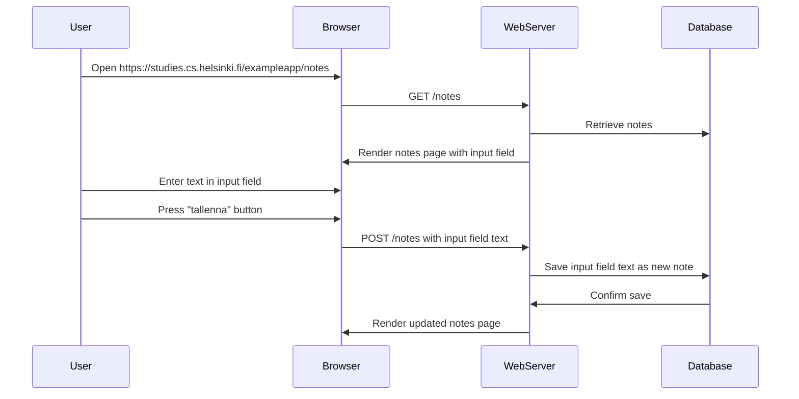

```mermaid
sequenceDiagram
    participant User
    participant Browser
    participant WebServer
    participant Database
    User ->> Browser: Open https://studies.cs.helsinki.fi/exampleapp/notes
    Browser ->> WebServer: GET /notes
    WebServer ->> Database: Retrieve notes
    WebServer ->> Browser: Render notes page with input field
    User ->> Browser: Enter text in input field
    User ->> Browser: Press "tallenna" button
    Browser ->> WebServer: POST /notes with input field text
    WebServer ->> Database: Save input field text as new note
    Database ->> WebServer: Confirm save
    WebServer ->> Browser: Render updated notes page
```
